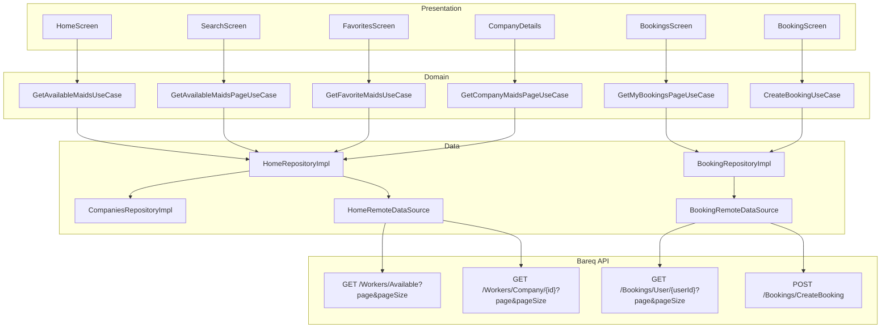

# Bareq Flutter App — Post-Fix Technical Report

**Project:** `sitt_app` (Bareq customer mobile app)  
**Original audit:** `FLUTTER_TECHNICAL_REVIEW.md` (May 2026, audit-only)  
**Backend compatibility pass:** `FLUTTER_BACKEND_COMPATIBILITY_FIXES.md`  
**Report date:** May 2026 (after backend compatibility update)  
**Scope:** Impact of pagination, endpoint, error-handling, and API-dedupe fixes on production readiness

---

## 1. Executive Summary (Updated)

The app received a **focused backend-compatibility and stability pass** (no UI redesign). Major networking and list-loading issues from the original audit are **resolved or materially improved**. The app is **closer to closed-beta / production** for API correctness and crash avoidance on list/booking flows, but **not fully store-ready** without HTTPS, bundle IDs, image caching, and broader architecture cleanup.

### Overall readiness (revised)

| Area | Before | After | Notes |
|------|--------|-------|-------|
| Architecture | C+ | C+ | Same structure; booking/home data paths slightly cleaner |
| Networking | D+ | **B-** | Paged APIs, status mapping, debug-only logs; still HTTP, no refresh token |
| State management | C | C | Home cubit lifecycle fixed; most screens still `setState` + GetIt |
| Performance | C- | **C+** | Deduped home/search/favorites; pagination on search/bookings; home still loads 1 page only |
| Offline / errors | C- | **B-** | 409/401/403/404/429/5xx mapped; fewer silent wrong lists |
| Caching | D | D | Unchanged (no image/reference cache) |
| UI stability | B- | B- | Login butterfly fix retained; large screens unchanged |
| Production | D | D | `com.example.*`, debug signing, no Crashlytics — unchanged |

**Verdict:** Suitable for **backend-aligned closed beta** after manual QA. **Not** recommended for wide public store release until infrastructure and remaining high-priority items below are addressed.

### Top 3 risks remaining (updated)

1. **Cleartext HTTP API** (`http://102.203.200.55:5545`) — iOS ATS / security / compliance.
2. **Store blockers** — example bundle IDs, Android release debug signing, no crash analytics.
3. **`Workers/Available` reliability** — if backend returns 500, home/search show empty data (admin fallback intentionally removed).

### Top 3 improvements delivered

1. **Paginated list contract** — `PagedResult<T>`, `?page=1&pageSize=20` on workers, bookings, companies.
2. **Correct customer endpoints** — no `GetWorkers` / `GetBookings` in customer paths; company-scoped workers/bookings where needed.
3. **Booking 409 + error UX** — Arabic conflict message; no payment/confirmation on conflict; centralized failure types.

---

## 2. What Was Fixed (Audit Item → Status)

### Critical / API (from original review)

| ID | Issue | Status | Evidence |
|----|--------|--------|----------|
| API-01 | Duplicate `getAvailableMaids` + `getTopRatedMaids` (2× pipeline) | **Fixed** | `HomeCubit` single fetch + local sort; search/favorites/booking/maid/details use one call |
| API-02 | `Workers/Available` 500 → silent `getWorkers()` admin fallback | **Fixed** | `home_repository_impl` uses only paginated `Available`; no admin fallback |
| API-03 | No pagination | **Fixed** (partial) | Paged datasources/repos; infinite scroll on Search + Bookings; Home = page 1 |
| API-05 | No `CancelToken` | **Partial** | `DioClient` supports tokens; Search cancels on reload/dispose; other screens optional |
| API-06 | Company details 5+ redundant calls | **Improved** | `Workers/Company/{id}`; no dual maid use cases |
| API-08 | Favorites loads full catalog ×2 | **Improved** | `GetFavoriteMaidsUseCase` paged scan (max 25 pages); needs backend favorites-by-id for completeness |
| PERF-02 | Home double maid pipeline | **Fixed** | `home_cubit.dart` |
| PERF-03 | `BlocProvider` in `build()` | **Fixed** | `HomeScreen` → `StatefulWidget`, cubit in `initState` |
| PERF-04 | `didChangeDependencies` reload storm | **Fixed** | User load only; no `loadHomeData` on every dependency change |
| PERF-07 | Bookings `ListView` + `.map()` | **Fixed** | `ListView.builder` + pagination |
| PERF-09 | Search 500ms artificial delay | **Fixed** | Removed from `search_screen.dart` |
| NET-01 | `LogInterceptor` in release | **Fixed** | `kDebugMode` only in `dio_client.dart` |
| NET-04 | Weak/inconsistent error mapping | **Fixed** | `dio_failure_mapper.dart` + `ConflictFailure`, `RateLimitFailure`, `NotFoundFailure` |
| CR-02 | Unsafe maid JSON | **Improved** | `maid_model.dart` safe rating/reviewCount/image |
| CR-05 | `delete()` throws `Exception` | **Fixed** | `delete` rethrows `DioException` like other verbs |

### Booking / backend-specific (new pass)

| Item | Status |
|------|--------|
| `GET /api/Bookings/GetBookings` (admin) in customer app | **Removed** — `GetAllBookingsUseCase` deleted |
| User bookings | **Fixed** — `GET /api/Bookings/User/{userId}?page=&pageSize=` |
| Create booking HTTP 409 | **Fixed** — `ConflictFailure` + Arabic UI; stay on form |
| 401 on create | **Fixed** — logout redirect via `failureRequiresLogout` |
| 429 message | **Fixed** — Arabic rate-limit string |
| Company staff booking detail | **Improved** — `Bookings/Company/{companyId}` + JWT `companyId` |

### Still open (not in compatibility pass)

| ID | Issue | Priority |
|----|--------|----------|
| CR-03 | Company details mock fallback → wrong company | High |
| CR-04 | HTTP API / iOS ATS | Critical |
| PERF-01 | No `cached_network_image` | High |
| PERF-05 | Monolithic `booking_screen` / `home_screen` | Medium |
| PERF-06 | `MaidCard` animation controllers per cell | Medium |
| PERF-08 | Companies nested grid | Medium |
| PERF-10 | Google Fonts in builder | Low |
| PERF-11 | Splash 2s + blocking auth restore | Medium |
| API-04 | Date filter reload without debounce | Medium |
| API-07 | Booking details 30s poll | Medium |
| ARCH-01–07 | Layer violations, god widgets, thin features | Medium–High |
| NET-02 | No refresh token | High |
| NET-03 | Hardcoded base URL | High |
| NET-06 | No connectivity pre-check | Medium |

---

## 3. Architecture & Data Flow (After Fix)

**Customer app no longer calls:** `GET /api/Workers/GetWorkers`, `GET /api/Bookings/GetBookings`.

---

## 4. Networking (Updated)

| Topic | Before | After |
|-------|--------|-------|
| List response shape | Raw `List` or ad-hoc wrappers | `PagedResult` + `extractPagedItems` (backward-compatible with arrays) |
| Default page size | N/A (full fetch) | `page=1`, `pageSize=20` |
| Logging | Always on | Debug only (`kDebugMode`) |
| Errors | 401/403 basic | 400, 401, 403, 404, 409, 429, 5xx → typed failures |
| Booking conflict | Generic / crash risk | `ConflictFailure` + fixed Arabic copy |
| Base URL | HTTP hardcoded | **Unchanged** — must move to HTTPS for production |

---

## 5. Screen-by-Screen Behavior (After Fix)

| Screen | Network behavior | Pagination | Error / empty |
|--------|------------------|------------|---------------|
| **Home** | 1× available workers (page 1) + companies pages for filter | First 20 workers | Empty list on failure (no admin fallback) |
| **Search** | Paged `Available` on scroll | Infinite scroll + bottom loader | Retry UI on load error |
| **Bookings history** | Paged user bookings | Infinite scroll | Empty state + retry |
| **Booking create** | Create + user bookings for duplicate check | N/A | 409 Arabic; 401 → login |
| **Company details** | Company by id + paged company workers | Up to 25 pages | Loading skeleton |
| **Favorites** | Paged scan for favorite IDs | Internal multi-page | Empty favorites UI |
| **Favorites** | No longer 2× full worker pipelines | — | — |

---

## 6. Static Analysis

| Metric | Result |
|--------|--------|
| `flutter analyze` errors | **0** |
| Warnings / info | ~225 (mostly pre-existing `withOpacity` deprecation, style) |
| New compile errors from pass | None |

---

## 7. Manual QA Checklist (Required)

Run against **production-like backend** (paginated JSON, 409 on conflict):

- [ ] Login / logout / login again  
- [ ] Home loads without duplicate worker requests (observe network log in debug)  
- [ ] Search — first page, scroll load more, empty state  
- [ ] Company details — workers for that company only  
- [ ] Create booking — success path  
- [ ] Create booking — **409** shows Arabic message; does not open confirmation  
- [ ] Bookings history — scroll pagination  
- [ ] Favorites — saved maids appear (note: deep catalog may need many pages)  
- [ ] RTL / Arabic strings on new error keys  

---

## 8. Remaining Risks & Recommendations

### Backend-dependent

| Risk | Mitigation |
|------|------------|
| `Workers/Available` returns 500 | Fix server; client shows empty — correct but poor UX |
| Favorites incomplete if maid not in paged `Available` | Add `GET /Workers?ids=` or favorites API |
| Company staff JWT missing `companyId` | Add claim or dedicated booking-by-id endpoint |
| Worker calendar not fully blocked client-side | Rely on 409; optional worker availability API |

### Mobile / release (unchanged by this pass)

| Action | Priority |
|--------|----------|
| HTTPS API + env-specific base URL | P0 |
| Replace `com.example.*` bundle IDs | P0 |
| Release signing + ProGuard/R8 rules | P0 |
| `cached_network_image` for avatars | P1 |
| Firebase Crashlytics / Sentry | P1 |
| Remove company mock fallback (CR-03) | P1 |
| Debounce search date reload + wire `CancelToken` on all list screens | P2 |
| Split `booking_screen` / introduce cubits | P2 |

---

## 9. Related Documents

| Document | Purpose |
|----------|---------|
| `FLUTTER_TECHNICAL_REVIEW.md` | Original full audit (pre-fix baseline) |
| `FLUTTER_BACKEND_COMPATIBILITY_FIXES.md` | File-by-file changelog for compatibility pass |
| `FLUTTER_POST_FIX_TECHNICAL_REPORT.md` | **This document** — updated readiness after fixes |

---

## 10. Summary for Stakeholders

**Done:** The Flutter app now speaks the **paginated Bareq API**, uses **customer-correct endpoints**, handles **booking conflicts and standard HTTP errors** without crashing, avoids **duplicate worker fetches** on main journeys, and **does not log full HTTP bodies in release builds**.

**Not done:** HTTPS, store identity, image caching, full Clean Architecture enforcement, company error fallback removal, and several large-screen performance refactors from the original audit.

**Recommendation:** Proceed with **closed beta** against the updated backend after completing the manual QA checklist. Plan a **release hardening sprint** (HTTPS, bundle IDs, Crashlytics, image cache) before public store submission.
